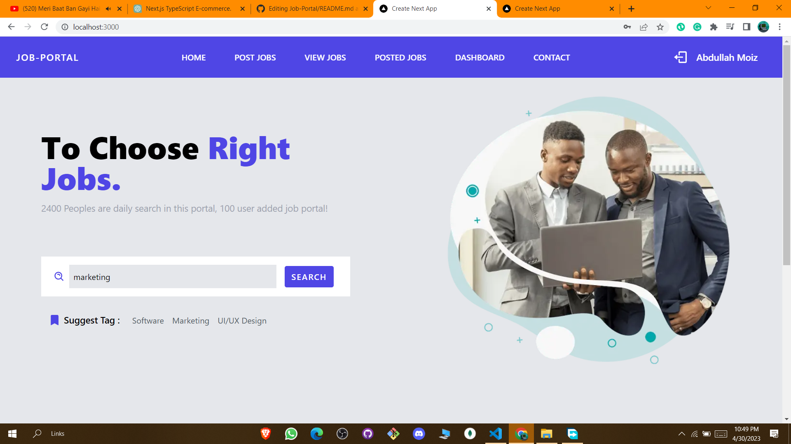
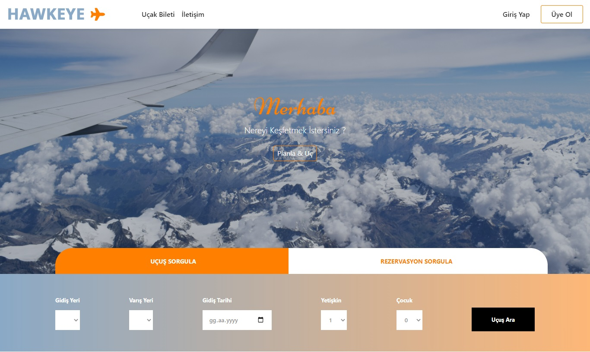

## Gym Membership Management
Implemented an end-to-end membership and activity management system for gym, supporting 3 distinct user roles, following MVC architecture
- 
- Tags: Category 1
- Badges:
  - Badge [blue]
- Buttons:
  - Link [https://gym-management-202.vercel.app/]

## Prototype Indeed
Designed a 3-tier distributed application to implement the functionalities of the Indeed website.
- 
- Tags: Category 2
- Badges:
  - Badge [blue]
- Buttons:
  - Link []

## Airline Ticketing System
Developed a Spring Boot solution for Flight Ticket Booking using React and AWS RDS for secure RDBMS cloud storage.
- 
- Tags: Category 3
- Badges:
  - Badge [blue]
- Buttons:
  - Link [https://example.com]